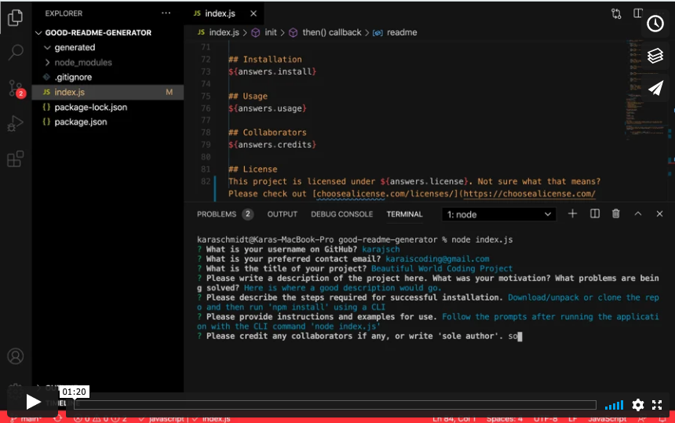

# Project Title 
## Good README Generator

## Table of Contents
- [Description](#project-description)
- [Installation](#installation)
- [Usage](#usage)
- [License](#license)
- [Collaborators](#collaborators)
- [Feedback](#feedback)

## Project Description 
The Good README Generator is the perfect solution for someone who doesn't want to deal with the hassle of constantly creating README documents from scratch. The Generator takes the busy work out, allowing the user to simply run the application, enter the applicable information, and have the README generated immediately exactly where it should be.

## Installation 
Download/unpack or clone the repo and then run 'npm install' using a CLI.

## Usage 
Follow the prompts after running the application with the CLI command 'node index.js'.

## Collaborators
sole author

## License
This project is licensed under MIT License. Not sure what that means? Please check out [choosealicense.com/licenses/](https://choosealicense.com/licenses/) for more information.

## Feedback
For all inquiries about this project, please contact me on Github - @[karajsch](https://github.com/karajsch) - or you can email me at karaiscoding@gmail.com.
